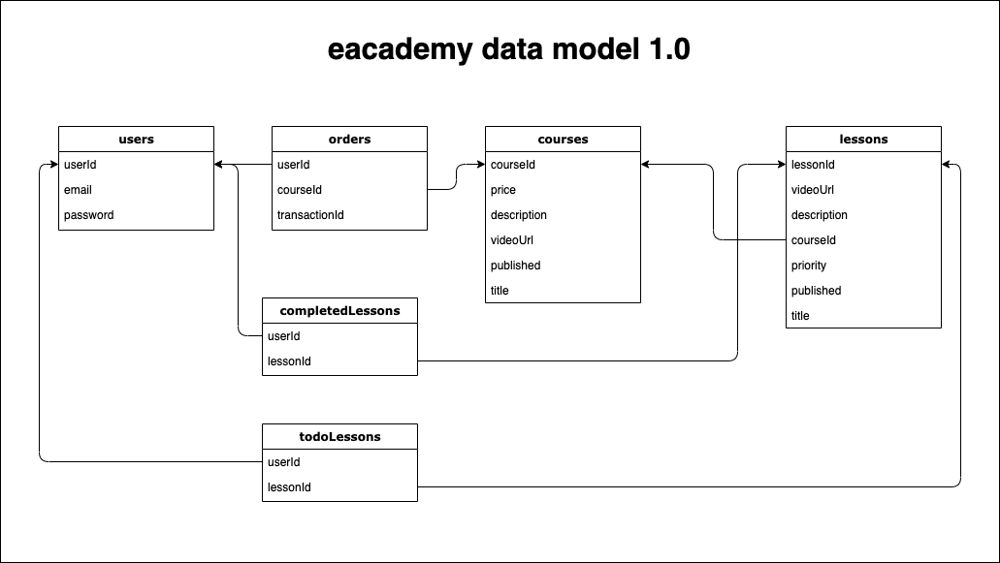

# Sprint 1 - Getting to the skate level.

- [Sprint backlog](https://github.com/migueldf10/eacademy-gatsby-react-redux/projects/1#column-10091721)
- [Skateboard diagram using Sketch](https://github.com/migueldf10/eacademy-gatsby-react-redux/tree/feat-diagram/project/20-07-20%20Skateboard%20sprint/Skateboard%20Diagram.sketch)
- [Skateboard screenshots](https://github.com/migueldf10/eacademy-gatsby-react-redux/tree/feat-diagram/project/20-07-20%20Skateboard%20sprint/Screens)
